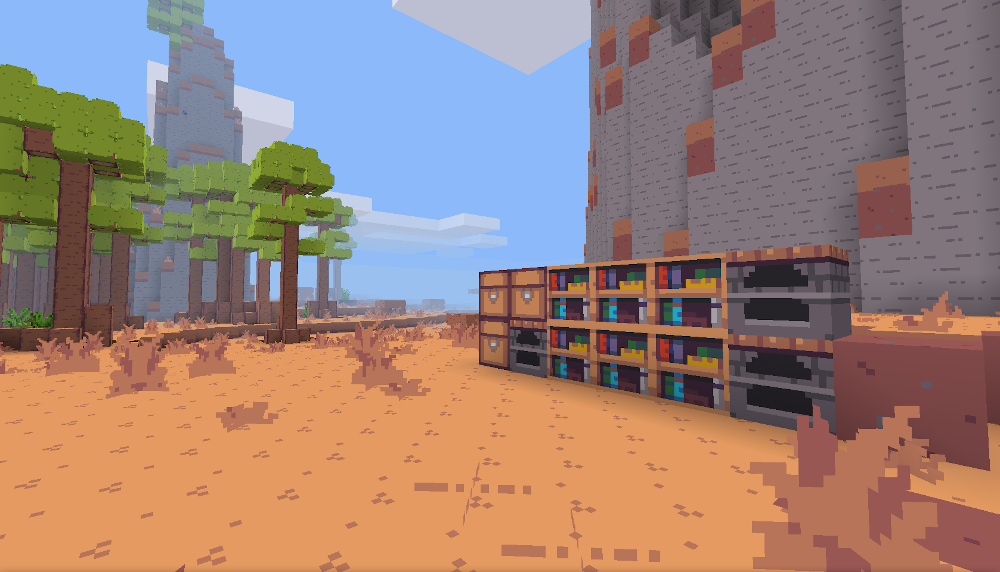

# soothing32plus

This mod is a fork of Soothing 32, a lightweight yet aesthetically pleasing texture pack for Minetest developed by <a href="https://gitlab.com/zughy-friends-minetest/soothing-32">Zughy and friends</a>. You can support his work <a href="https://liberapay.com/EticaDigitale/donate">here</a>.

Note: The texture pack consists of just 32 colors, which can be found in the <a href="https://lospec.com/palette-list/zughy-32">Zughy32 palette</a>.

  

### Supported Mods
* Beds
* Bones
* Bucket
* Butterflies
* Carts
* Default
* Doors
* Dye
* Fire
* Fireflies
* Flowers
* Screwdriver
* Stairs
* Tnt
* Vessels
* Wool
* Xpanes

---

#### This Mod Is a Fork
Zughy has closed contributions to Soothing 32 and indicated that they will likely remain so permanently. Soothing32plus is a fork, made at his suggestion, in order to extend support for additional mods.
